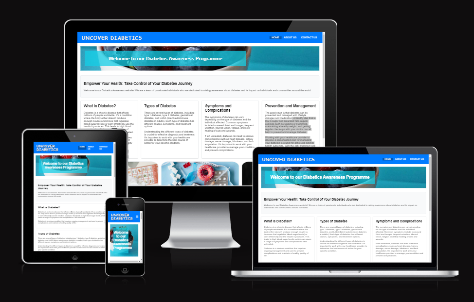
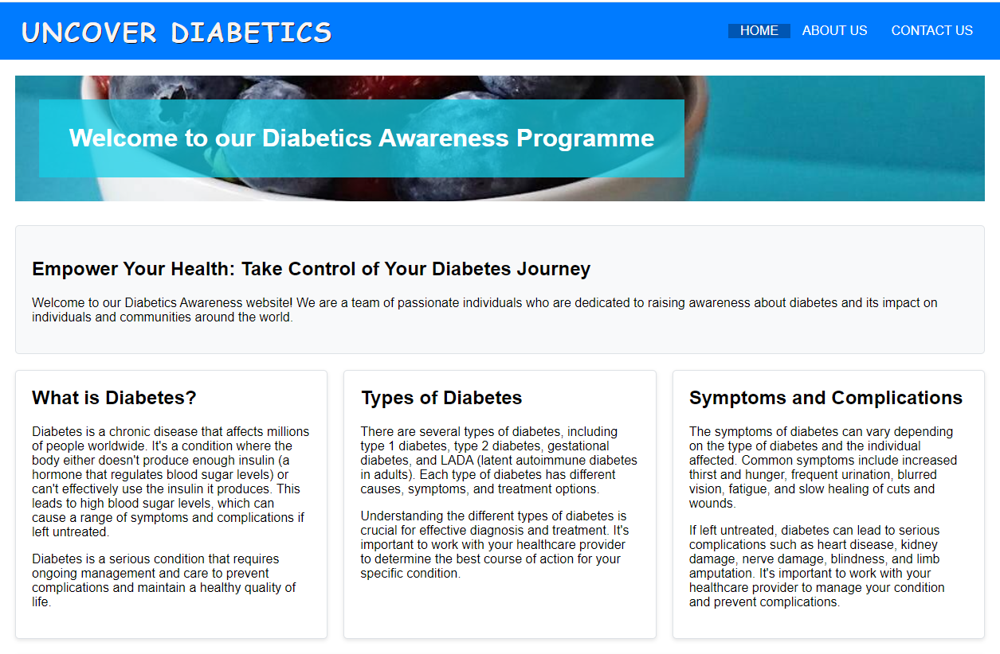
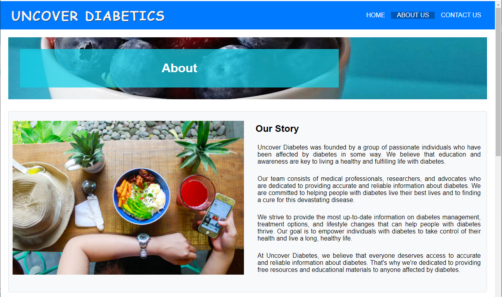
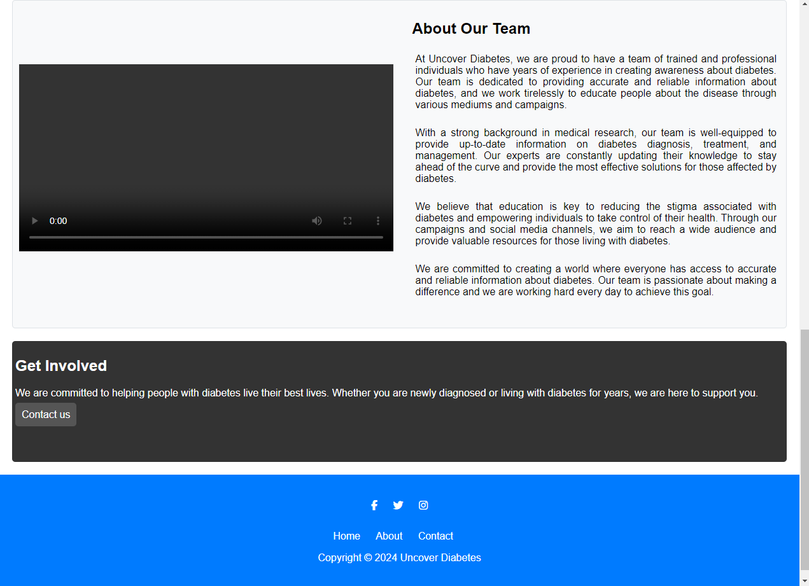
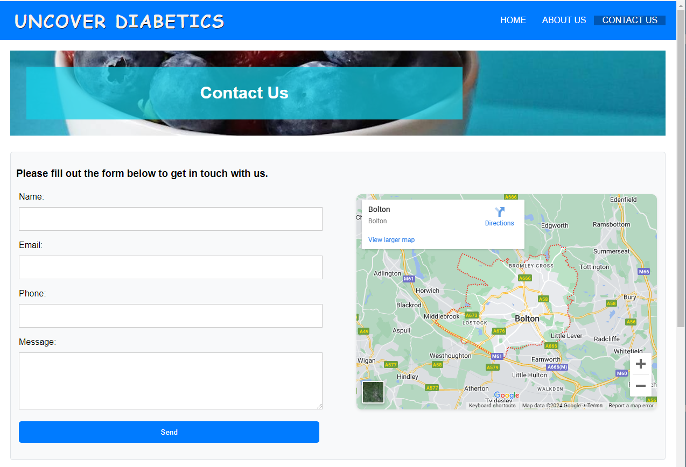
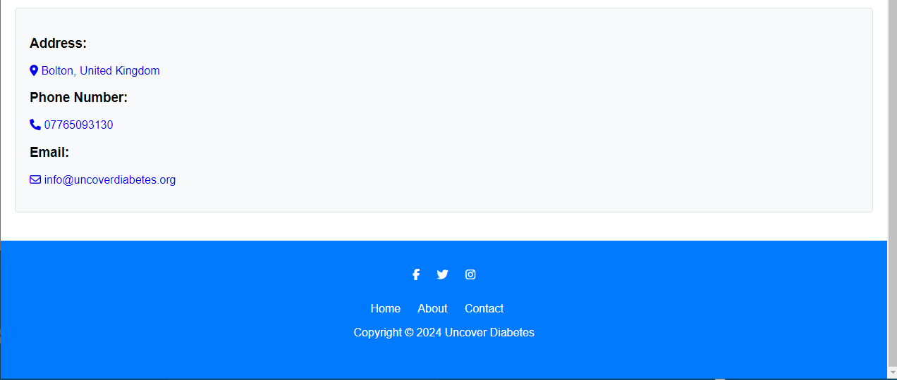

# Uncover Diabetics

Project Overview:
"Uncover Diabetics" is a web-based project aimed at creating awareness about diabetes, its types, symptoms, complications, prevention, and management. The website aims to provide valuable information and resources to individuals who are affected by diabetes or are interested in learning more about the disease.

## Features 

### Existing Features

- __Navigation Bar__

  - Featured on all three pages, the full responsive navigation bar includes links to the Logo, Home page, About page, Contact page and is identical in each page to allow for easy navigation.
  - This section will allow the user to easily navigate from page to page across all devices without having to revert back to the previous page via the ‘back’ button.

- __Home Page__

  - he home page provides an overview of diabetes, its types (Type 1, Type 2, Gestational), symptoms, complications  and prevention and management strategies. The page features a hero section with a background image and a brief introduction to diabetes, followed by sections on the different types of diabetes and their symptoms.

  
  

- __About Page__

  - The about page shares the story of how Uncover Diabetes came to be, what we do , our mission (to empower people to take control of their health), and information about our team. 

  
  
  

- __Contact Page__

  - The contact page provides our contact information (address, phone number, email) and a contact form that allows users to send us messages or ask questions. This page also includes a map with our physical location marked.

  
  

### Features Left to Implement

## Testing 

 