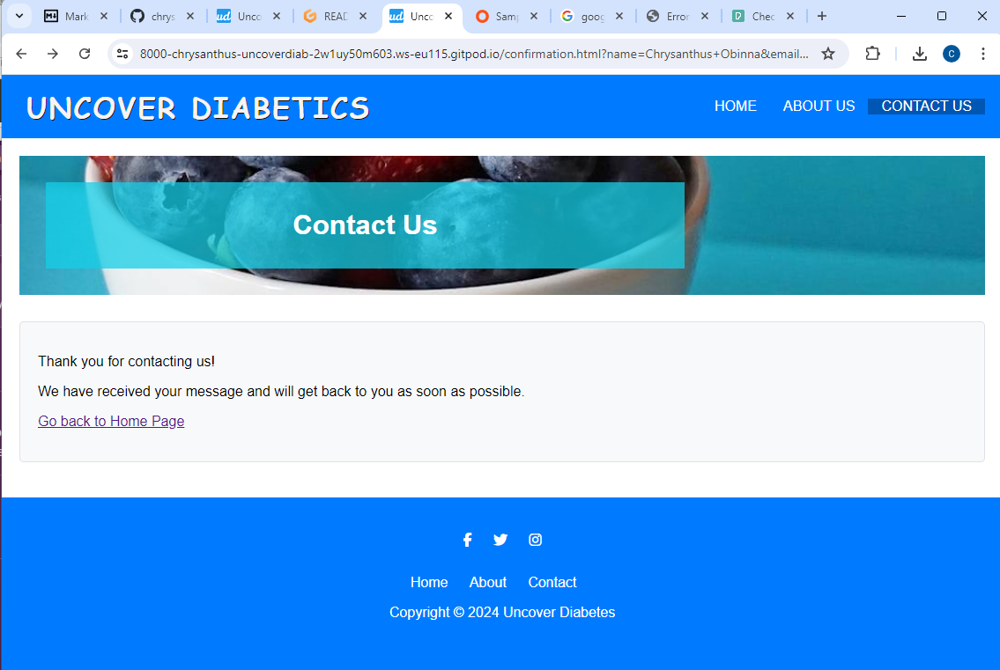

# Uncover Diabetics

Project Overview:
"Uncover Diabetics" is a web-based project aimed at creating awareness about diabetes, its types, symptoms, complications, prevention, and management. The website aims to provide valuable information and resources to individuals who are affected by diabetes or are interested in learning more about the disease.

## Technologies Used

### Frontend
- **HTML**: Used for structuring the web pages and ensuring semantic markup.
- **CSS**: Employed for styling and layout adjustments, ensuring a visually appealing and consistent user interface across different devices.

## Features 

### Existing Features

- __Navigation Bar__

  - Featured on all three pages, the full responsive navigation bar includes links to the Logo, Home page, About page, Contact page and is identical in each page to allow for easy navigation.
  - This section will allow the user to easily navigate from page to page across all devices without having to revert back to the previous page via the ‘back’ button.

- __Home Page__

  - he home page provides an overview of diabetes, its types (Type 1, Type 2, Gestational), symptoms, complications  and prevention and management strategies. The page features a hero section with a background image and a brief introduction to diabetes, followed by sections on the different types of diabetes and their symptoms.

  
  

- __About Page__

  - The about page shares the story of how Uncover Diabetes came to be, what we do , our mission (to empower people to take control of their health), and information about our team. 

  
  
  

- __Contact Page__

  - The contact page provides our contact information (address, phone number, email) and a contact form that allows users to send us messages or ask questions. This page also includes a map with our physical location marked.

  
  

- __The Footer__ 

 - The footer section provides links to our social media profiles, which will open in a new tab to ensure easy navigation for the user. This section is valuable to the user as it encourages them to stay connected with us through social media.

### Features Left to Implement

- Backend code for sending mail functionality at the contact page
- JavaScript code to improve user-friendly design and user experience

## Testing 

I have thoroughly tested the website to ensure that it works as intended. Here are the results:

* I used [HTML Validator](https://validator.w3.org/) to validate the HTML structure of the website. The result was "Document checking completed. No errors or warnings to show."

* I used [CSS Validator](https://jigsaw.w3.org/css-validator/) to validate the CSS code of the website. The result was "Congratulations! No Error Found."

* I tested the website using Google Chrome Lighthouse, an open-source, automated tool for measuring the quality of web pages. Here is a screenshot of the result:

I tested all features, including the contact form, social media links, and responsive design. I also tested the website on different browsers (Chrome, Firefox, Safari) and screen sizes (desktops, tablets, mobile phones).

### Responsive Design Testing

To ensure the website's responsiveness, I used Google Chrome Developer Tools to simulate various devices. Here are the details of the tests:

- **Mobile Phone**
  - Tested on a mobile phone using Chrome Developer Tools.
  - 

- **iPad**
  - Tested on an iPad using Chrome Developer Tools.
  - 

- **Desktop**
  - Tested on a desktop.
  - 

### Contact Form Testing
Testing the form submission process, ensuring the user receives a confirmation, and you receive the message. The contact form was submitted to "https://formdump.codeinstitute.net/" using the POST method. Here is the result screenshot: 

During testing, I discovered some minor issues with broken links on the footer area and a video file on the contact page. These issues were fixed, and the website was tested again to confirm that it is in good condition.

Despite these minor issues, I am confident that our website provides an easy and straightforward way for users to access the information they need. We believe that our website meets the requirements specified in the project brief and is ready for launch.
 
 

## Deployment 

**Step 1: Download the Project**

* Go to the GitHub repository: https://github.com/chrysanthusobinna/uncover-diabetics
* Click on the "Code" button and copy the URL.
* Open your terminal or command prompt.
* Run the following command: `git clone https://github.com/chrysanthusobinna/uncover-diabetics.git`

**Step 2: Create a GitHub Repository**

* Go to your GitHub account and log in.
* Click on the "+" button to create a new repository.
* Fill in the required information (repository name, description, etc.).
* Click "Create repository".

**Step 3: Upload the Project to GitHub**

* Open the terminal or command prompt and navigate to the project directory: `cd uncover-diabetics`
* Run the following command: `git init`
* Run the following command: `git add .`
* Run the following command: `git commit -m "Initial commit"`
* Run the following command: `git remote add origin <your-github-repository-url>`
* Run the following command: `git push -u origin master`

**Step 4: Deploy on GitHub**

* Go to your GitHub repository and click on the "Code" tab.
* Click on the "Deployments" tab.
* Click on "New deployment".
* Choose "GitHub Pages" as the deployment method.
* Choose the branch you want to deploy (e.g., master).
* Click "Deploy".

That's it! Your project should now be deployed on your GitHub account.
The live link for this project can be found here - https://chrysanthusobinna.github.io/uncover-diabetics/

## Credits 

**Content**

* The icons in the footer and contact page were taken from [ Font Awesome](https://fontawesome.com/).

**Media**

* The photos used on the Home Page, About Page and Contact page are from [Pexels](https://www.pexels.com/).

**Code**

* Instructions on how to implement responsive navigation toggling a dropdown menu using CSS were taken from [YouTube Tutorial](https://youtu.be/ekC1dVIzEh8).
* The favicon image was created using [Favicon.io](https://favicon.io/).

**Google Maps**

* The map on the contact page is implemented using [Google Maps](https://maps.google.com/).